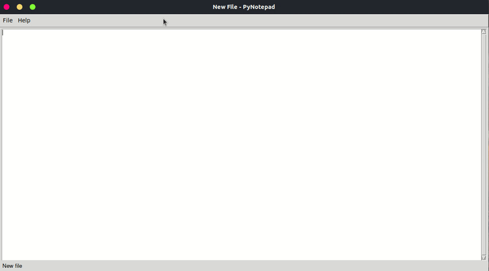

# Python Notepad
This is a simple notepad written in python using [PySimpleGUI](https://pypi.org/project/PySimpleGUI/)



All screenshots are in [screenshots.md](screenshots.md)

# Install
```
git clone https://github.com/DAFEX6390/python-notepad.git

cd python-notepad

pip3 install -r requirements.txt

python3 src/main.py
```

# Creating an executable using [PyInstaller](https://pypi.org/project/pyinstaller/)

## On Windows
```
pyinstaller --add-data src/assets/icon.png;assets src/main.py --windowed
```

## On Linux
```
pyinstaller --add-data 'src/assets/icon.png:assets' src/main.py
```

# PyInstaller alternative
If you don't like to use a lot of commands, you can use [psgcompiler](https://github.com/PySimpleGUI/psgcompiler) to compile the program using a simple interface